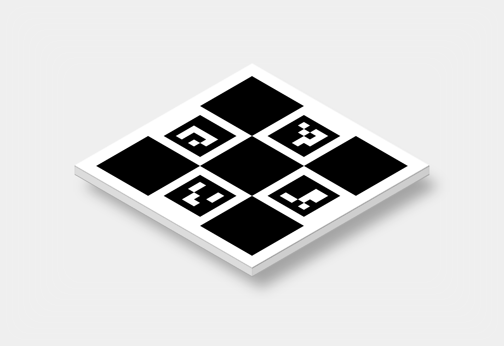

# ChArUco Plate Target

This target generates a square 3 x 3 ChArUco plate as two aligned STL bodies for multi-color printing workflows.

## Render



## Default Geometry

- White base plate: `220 mm x 220 mm x 4 mm`
- Active board area: `88%` of the plate width
- ChArUco grid: `3 x 3`
- ArUco dictionary: `DICT_4X4_50`
- Marker IDs: `0, 1, 2, 3`
- Black pattern exported as a separate inlay body embedded `0.8 mm` into the top of the white plate

## Usage

```bash
python -m src.calibration_target_gen charuco_plate
```

## Output Artifacts

```text
out_charuco_plate_YYYY-MM-DD_HH-MM-SS/
├── charuco_plate_white.stl
├── charuco_plate_black.stl
├── charuco_plate_preview.png
├── run_info.txt
└── manifest.json
```

Import the two STL files into Bambu Studio as parts of the same object, then assign the white and black filaments to the corresponding bodies.
